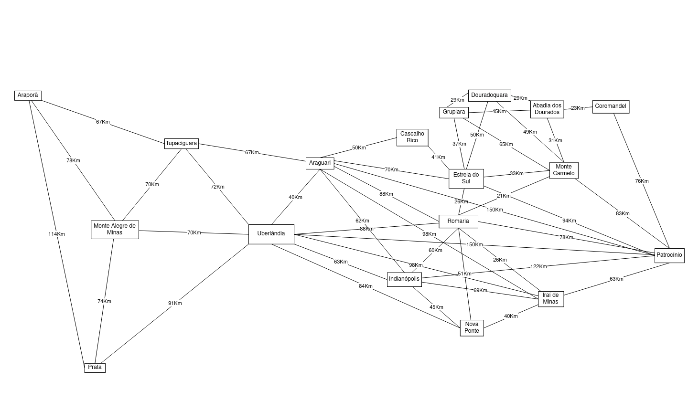

# Vacinas COVID na SRS Uberlândia

Neste trabalho, buscamos obter o melhor caminho para distribuir as vacinas contra o COVID-19 na Superintendência Regional de Saúde de Uberlândia, formada por 18 munı́cipios, por meio do problema do Carteiro Chinês.

